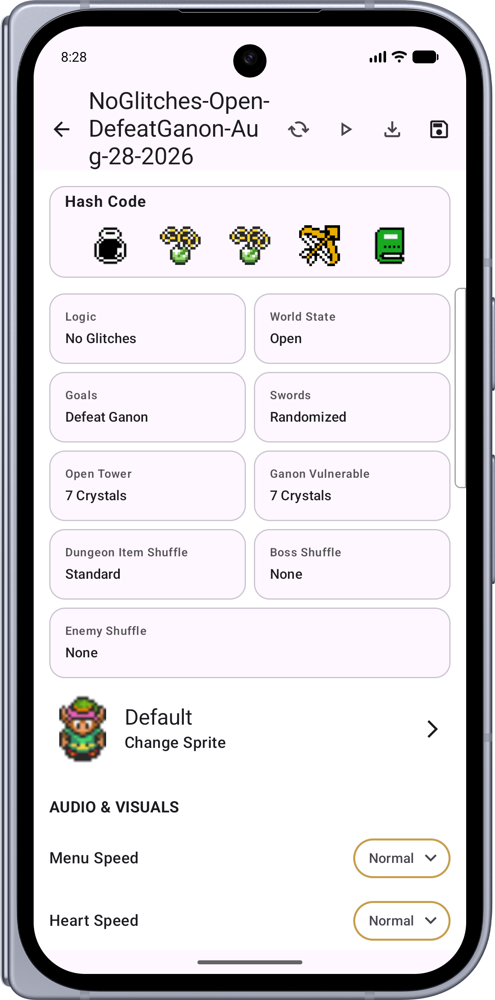
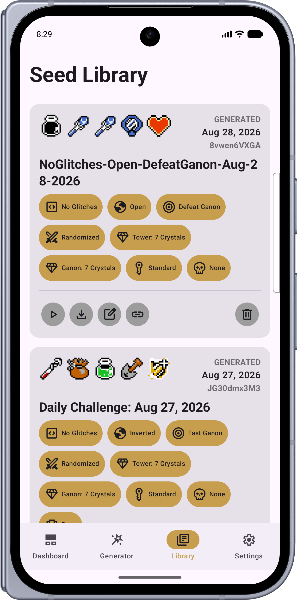

# ALTTPR Multiplatform Client

A Kotlin Multiplatform application for creating and managing **A Link to the Past Randomizer (ALTTPR)** seeds and custom sprites across **Android**, **iOS**, and **Desktop (JVM)** using Compose Multiplatform.

## Screenshots

| Android | iOS | Desktop |
| :---: | :---: | :---: |
|  |  |  |
|  |  |  |

---

## Useful Links

- **Official Website:** [ALTTPR](https://alttpr.com/en)
- **Randomizer Source Code & Logic:** [GitHub - sporchia/alttp_vt_randomizer](https://github.com/sporchia/alttp_vt_randomizer)
- **Community Discord:** [ALTTPR Discord](https://discord.gg/alttprandomizer)

---

## Project Structure

* [/iosApp](./iosApp/iosApp) contains the iOS application entry point and SwiftUI code.
* [/shared](./shared/src) contains the core Kotlin Multiplatform shared code, UI, viewmodels, and local persistence layer:
  - [commonMain](./shared/src/commonMain/kotlin) - Shared code for all targets.
  - [androidMain](./shared/src/androidMain/kotlin) - Android-specific implementations (e.g. storage).
  - [iosMain](./shared/src/iosMain/kotlin) - iOS-specific implementations.
  - [jvmMain](./shared/src/jvmMain/kotlin) - Desktop-specific implementations.

---

### Running the Apps

Use the run configurations provided in your IDE or the following Gradle commands:

- **Android app:** `./gradlew :androidApp:assembleDebug`
- **Desktop app:**
  - Hot reload: `./gradlew :desktopApp:hotRun --auto`
  - Standard run: `./gradlew :desktopApp:run`
- **iOS app:** Open the [/iosApp](./iosApp) directory in Xcode and run it on a simulator or device.

### Running Tests
- **Desktop tests:** `./gradlew :shared:jvmTest`
---

Learn more about [Kotlin Multiplatform](https://www.jetbrains.com/help/kotlin-multiplatform-dev/get-started.html).
